```{r setup, include=FALSE}
options(htmltools.dir.version = FALSE)
```

```{r logo, echo=FALSE}
xaringanExtra::use_logo(image_url = "logo_cnrs.png")
```

# Objectifs d'apprentissage

1. Savoir utiliser R et RStudio.

2. Manipuler les objets dans R.

3. Installer et utiliser les packages R.

4. Obtenir de l'aide.

5. Ecrire un script dans R.

6. Charger, explorer et enregistrer des données.

7. Manipuler des jeux de données avec l'aide du `tidyerse`.

---

# RStudio

```{r add_defi, echo=FALSE, eval=TRUE, out.width="10%"}
knitr::include_graphics("../images/defi.jpg")
```

Ouvrir RStudio !

```{r, echo=FALSE}
library(countdown)
countdown(minutes = 00, seconds = 30)
```

--

```{r add_rstudio, echo=FALSE, eval=TRUE, out.width="80%"}
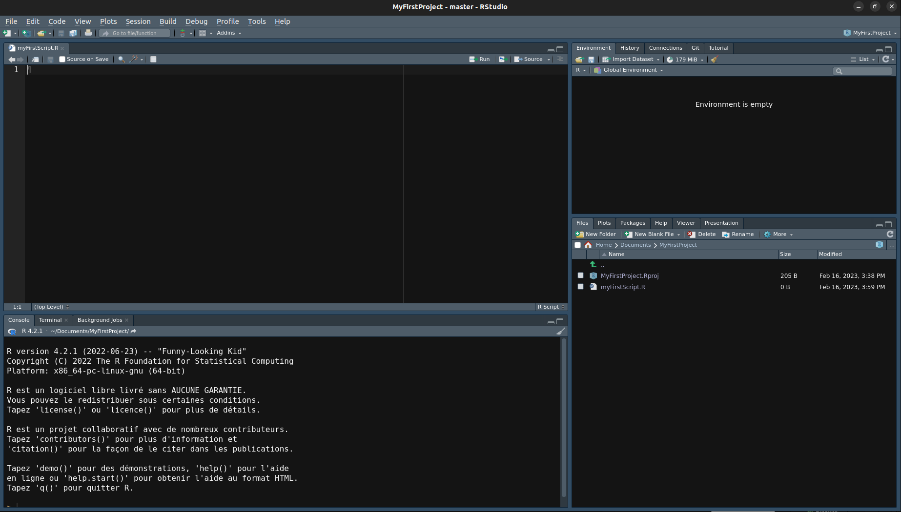
```

---

## La console R

```{r add_console, echo=FALSE, eval=TRUE, out.width="80%"}
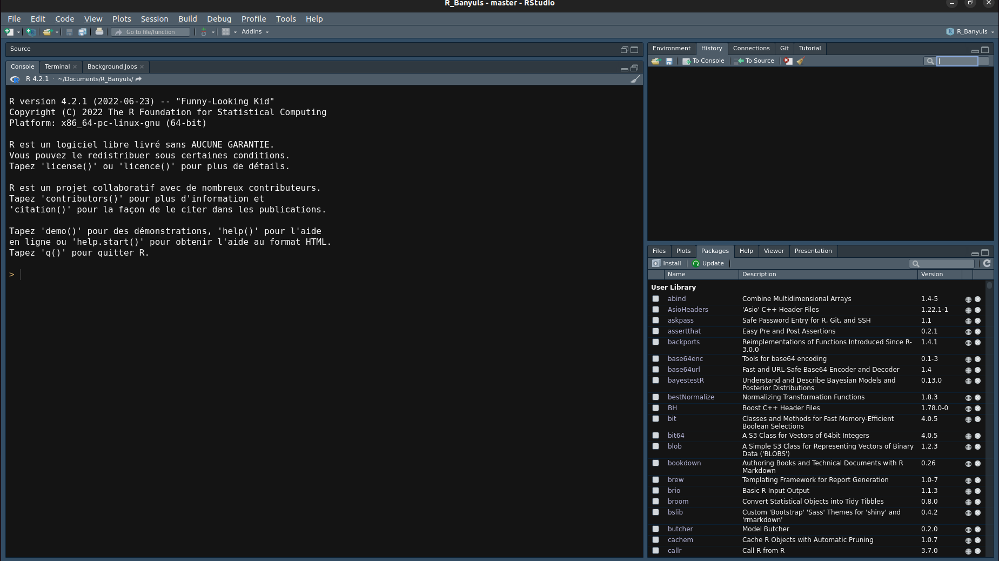
```

- On commence à écrire du code R après l'affichage d'un prompt de la forme **>**.
- On doit toujours appuyer sur **"entrée"** pour que le code s'exécute et affiche un résultat.
- Pour effacer la console on peut utiliser le raccourci clavier `Ctrl+l`.

---

## Opérateurs arithmétiques

```{r add_defi-2, echo=FALSE, eval=TRUE, out.width="10%"}
knitr::include_graphics("../images/defi.jpg")
```

Calculez le résultat de l'expression suivante: $(3 + 2) * 4 - \frac{7}{2}$

```{r, echo=FALSE}
library(countdown)
countdown(minutes = 00, seconds = 30)
```

--

**Solution:**

```{r add_defi-2_solution}
(3 + 2) * 4 - 7/2
```

> L'ordre des opérations est respecté sous R.

---

## Opérateurs arithmétiques (continue)

```{r add_defi-3, echo=FALSE, eval=TRUE, out.width="10%"}
knitr::include_graphics("../images/defi.jpg")
```

Quelle est l'aire d'un carré de 5 cm et d'un cercle de rayon égale à 5 cm ?

> *Astuce*: pour faire un exposant, utilisez la commande `^` et   pour le $\pi$, utilisez la constante `pi`.

```{r, echo=FALSE}
library(countdown)
countdown(minutes = 00, seconds = 30)
```

--

**Solution:**

```{r add_defi-3_solution}
5^2;pi * 5^2
```

> Attention à l'unité ici, cm²

---

## Aides dans R

Pour obtenir de l'aide sur une fonction, il suffit d'exécuter la commande `?` ou la fonction `help()` devant le nom de la fonction.

```{r help, eval=FALSE}
help(print)
?pi
```

---

## Les objets R

- La création d'un objet se fait par affection via l'opérateur `<-`.

- Les noms d'objets doivent **toujours commencer par une lettre**.

- R est **sensible à la casse**.

- Les **caractères spéciaux sont interdits** !

<u> Exemples: </u>

```{r objets}
num <- 3.14 # crée l'objet num en lui donnant la valeur 3.14
num_2 <- num # num_2 reçoit la valeur de num
num -> num_3 # num_3 reçoit la valeur de num
```

---

## Les objets R (continue)

```{r add_defi-4, echo=FALSE, eval=TRUE, out.width="10%"}
knitr::include_graphics("../images/defi.jpg")
```

- Calculez la racine carrée de la somme des carrés de 3 et 4.

- Affecter le résultat à l'objet x.

- Afficher le résultat de x.

> *Astuce*: Utilisez la fonction `sqrt` pour avoir la racine carrée et `print` pour afficher le résultat d'un objet.

```{r, echo=FALSE}
library(countdown)
countdown(minutes = 1, seconds = 15)
```

--

**Solution:**

```{r add_defi-4_solution}
x <- sqrt(3^2+4^2)
print(x)
```

---

## Créer un projet dans RStudio

Pour créer un nouveau projet allez dans File > New Project...

```{r projet, echo=FALSE, eval=TRUE, out.width="80%"}
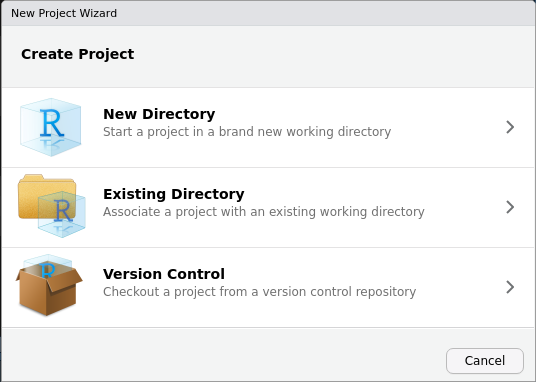
```

---

## Créer un projet dans RStudio (continue)

```{r add_defi-5, echo=FALSE, eval=TRUE, out.width="10%"}
knitr::include_graphics("../images/defi.jpg")
```

- Créer un nouveau projet dans RStudio pour réaliser les prochains défis à résoudre.
- Une fois créé, ajouter de nouveaux dossiers data, reports et plots en cliquant sur le bouton `New Folder`.

```{r, echo=FALSE}
library(countdown)
countdown(minutes = 1, seconds = 15)
```

--

**Solution:**

1. Ouvrez RStudio et allez dans `File` > `New Project`.
2. Dans la fenêtre `New Project`, sélectionnez `New Directory` et cliquez sur `Next`.
3. Dans la fenêtre suivante, sélectionnez `New Project` et donnez un nom à votre projet, puis choisissez un emplacement sur votre ordinateur pour le stocker. Cliquez sur `Create Project`.
4. Dans l'onglet `Files` à droite de RStudio, cliquez sur le bouton `New Folder` et nommez le dossier *data*. Répétez cette étape pour créer les dossiers *plots* et *reports*.

---

## Créer un script R

```{r script, echo=FALSE, eval=TRUE, out.width="50%", fig.align = "default"}
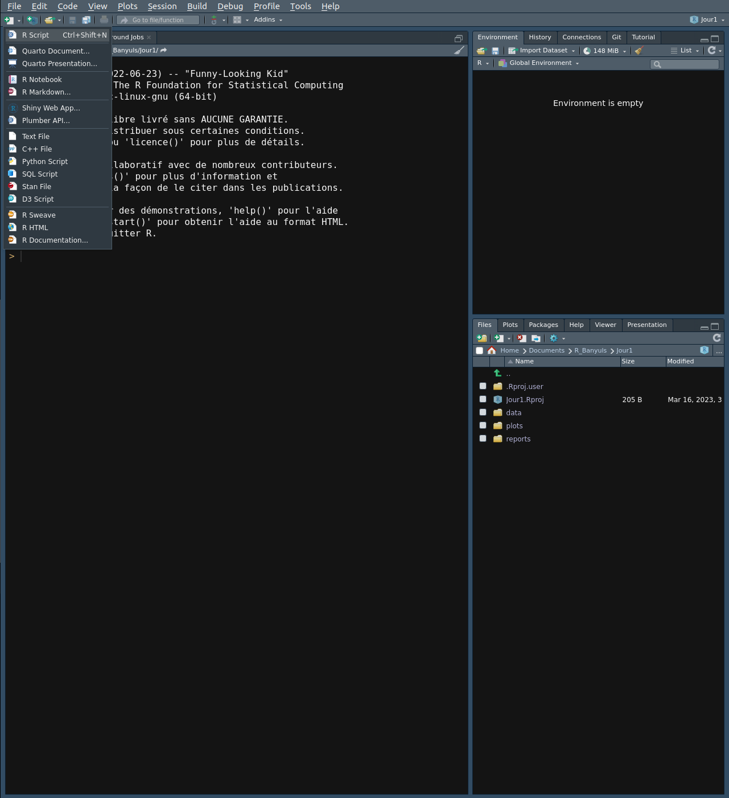
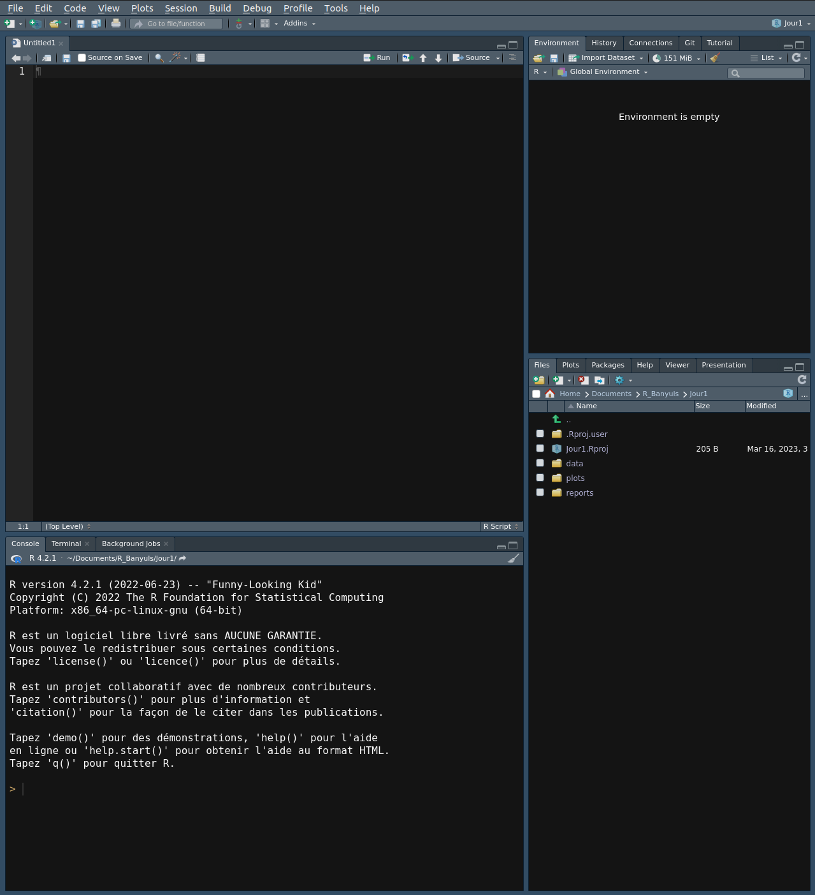
```

---

## Créer un script R (continue)

```{r add_defi-6, echo=FALSE, eval=TRUE, out.width="10%"}
knitr::include_graphics("../images/defi.jpg")
```

1. Créez un nouveau script R et écrivez du code: a = 5; b = 4

2. Effectuez les **opérations arithmétiques** suivantes: addition, soustraction, multiplication, division et puissance. Affectez chaque opération à un **nouveau objet**.

3. Affichez le **résultat** de chaque opération.

> *Astuce*: `<-`, `+`, `*`, `\`, `^` et `print()`

```{r, echo=FALSE}
library(countdown)
countdown(minutes = 5, seconds = 00)
```

---

## Créer un script R (continue)

**Solution:**

```{r add_defi-6_solution, results='hide'}

#### Paramètres de bases ####

a <- 5
b <- 4

#### Opérations ####

addition <- a + b
soustraction <- a - b
multiplication <- a * b
division <- a / b
puissance <- a ^ b

#### Affichage ####

print(addition)
print(soustraction)
print(multiplication)
print(division)
print(puissance)

```

---

## Sauver son script R

```{r add_defi-7`, echo=FALSE, eval=TRUE, out.width="10%"}
knitr::include_graphics("../images/defi.jpg")
```

Sauvez votre script précédemment créé en utilisant la commande `Ctrl+S` et enregistrez le sous le dossier, `reports`, initialement créé.

```{r, echo=FALSE}
library(countdown)
countdown(minutes = 00, seconds = 30)
```

---

## Nettoyage

- R conserve en mémoire tous les objets créés dans la session.
- On utilise les fonctions `objects` ou `ls` pour connaître les objets de la session.
- Dans RStudio ils sont consultables via l'onglet `Environment`

Pour supprimer l'objet x, on tape:

```{r nettoyage, eval=FALSE}
rm(x)
```

Pour supprimer plusieurs objets, on tape:

```{r nettoyage_2, eval=FALSE}
rm(x1, x2, x3)
```

Pour supprimer tous les objets de l'environnement de travail, appuyez sur le "balai" de l'onglet `Environment` ou tapez:

```{r nettoyage_3, eval=FALSE}
rm(list=ls())
```

---

## Nettoyage (continue)

```{r add_defi-8`, echo=FALSE, eval=TRUE, out.width="10%"}
knitr::include_graphics("../images/defi.jpg")
```

- Amusez-vous à supprimer l'objet `addition` du script précédent.

- Affichez l'objet `addition` pour vérifier que l'objet est bien supprimé.

- Supprimez tous les objets créés de l'environnement de travail.

```{r, echo=FALSE}
library(countdown)
countdown(minutes = 00, seconds = 45)
```

--

**Solution:**

```{r add_defi-8_solution, eval=FALSE}
source("../../Jour1/reports/exercices.R")
rm(addition)
rm(list = ls())
```

---

## Type de structures de données

|| Dimension | Mode | Exemple |
|:-:|:------:|:----:|:--------|
|**Vecteur**|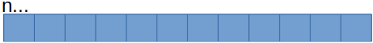|identique|c(1:12)|
|**Matrice**|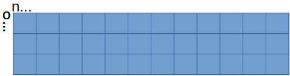|identique|matrix(data = c(1:36), nrow = 3, ncol = 12)|
|**Data Frame**|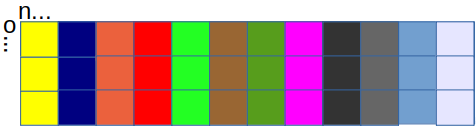|différent|data.frame(logique = c(T, F, T), nombre = c(1,2,3), nbr_déci = c(1.25, 1.2, 1.45), caractère = c("bleu", "blanc", "rouge")...)|
|**Array**|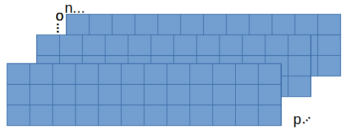|identique|array(c(1:36), dim = c(3,12,3))|
|**Liste**|Un ensemble de structures de données|différent|list(...)|

---

## Vecteur

.pull-left[
- Les valeurs d'un vecteur doivent avoir le **même mode**.

  - numériques

  - caractères

  - logiques

- Pour créer un vecteur, on peut utiliser:

  - la fonction `c()`

  - la fonction `rep()`

  - la fonction `seq()`

  - l'opérateur séquence `:`
]

--

.pull-right[
<u> Exemples: </u>

```{r vecteurs}

#### vecteurs numériques #####
num_vecteur <- c(1,2,3,4,5)
num_vecteur_bis <- 1:5
num_vecteur_2 <- rep(1,4)

#### vecteurs de caractères ####
car_vecteur <- c("Bleu", "Blanc", "Rouge")
car_vecteur_2 <- rep(car_vecteur, each=3)

#### vecteurs logiques ####
x <- c(10, 20, 30, 40)
res <- x < 25
res
```
]

---

## Vecteur (continue)

- Les vecteurs logiques sont en général générés grâce à des **opérateurs logiques**.   
  - On considère un vecteur contenant les cinq premier chiffres impaires: 

> impair <- c(1, 3, 5, 7, 9)


|Opérateur     |Description              |Exemple|
|-------------|-------------------------|-------------------------------|
|`<` et `>`  |inférieur ou supérieur à|`impair > 3`                    |
|`<=` et `>=`|inférieur/supérieur ou égale à |`impair >= 3`                   |
|`==`         |égale à         |`impair == 3`                   |
|`!=`         |non égale à            |`impair != 3`                   |
|`x`&#124;`y` |x OU y                   |`impair[impair >= 5` &#124; `impair < 3]`|
|`x & y`      |x ET y                  |`impair[impair >=3 & impair < 7]` |

---

## Vecteur (continue)

- La sélection d'une partie d'un vecteur se fait à l'aide de l'opérateur `[]`.

<u> Exemples: </u>

```{r sel_vect}
impair <- c(1, 3, 5, 7, 9)
impair[3] # donne le troisième élément de impair
impair[2:4] # donne les 2,3,4ème éléments de impair

impair[(impair >= 5) | (impair < 3)] # donne les éléments sup égale à 5 ou inf. à 3
impair[impair >= 3 & impair < 7] # donne les éléments qui sont à la fois sup. ou égale à 3 et inf. à 7 
```

---

## Vecteur (continue)

- Une autre méthode consiste à enlever les éléments du vecteur avec l'opérateur `-`.

<u> Exemples: </u>

```{r without_vect}
impair <- c(1, 3, 5, 7, 9)
impair[-3] # donne impair sans le troisième élément
impair[-(2:4)] # donne impair sans les 2,3,4ème éléments
```

---

## Vecteur (continue)

```{r add_defi-9, echo=FALSE, eval=TRUE, out.width="10%"}
knitr::include_graphics("../images/defi.jpg")
```

1. Créez un vecteur contenant les **nombres entiers de 1 à 10** à l'aide de la fonction `seq()`.

2. Créez un vecteur contenant **cinq fois le nombre 3** à l'aide de la fonction `rep()`.

3. Créez un vecteur contenant les **nombres entiers pairs** de 2 à 10 à l'aide de la fonction `seq()`.

4. Créez un vecteur `sexe` contenant *6 éléments*: 3 'M' et 3 'F'.
  
  - Extraire de ce vecteur uniquement les **'F'**

> *Astuce*: `?seq()`, `?rep()`

```{r, echo=FALSE}
library(countdown)
countdown(minutes = 04, seconds = 00)
```

---

## Vecteur (continue)

**Solution:**

.pull-left[
```{r add_defi-9_part1solution}

#### 1 ####
num_vec <- seq(1:10)
num_vec

#### 2 ####
rep_vec <- rep(3, 5)
rep_vec
```
]

.pull-right[
```{r add_defi-9_part2solution}
#### 3 ####
pair <- seq(from = 2, to = 10, 
            by = 2)
pair

#### 4 ####
sexe <- c("M", "M", "M", 
          "F", "F", "F")
res_F <- sexe[sexe == "F"]
res_F
```
]
---

## Data frame

- Une liste de vecteur de même longueur.

- Les modes peuvent différer.

- Une colonne = une variable.

- Une ligne = une observation.

<u> Exemple: </u>

```{r df}
df <- data.frame(x = 1:2, y = c(3,5))
print(df)
```

---

## Data frame

- Pour extraire une partie d'un data frame, vous devez spécifier **deux dimensions**: numéro de ligne et de colonne entre `[]`:

.pull-left[

<u> Exemples: </u>

```{r df_2}
df <- data.frame(x = 1:2, 
                 y = c(3,5))
df[1,] # Extrait la 1ère ligne
df[, 2] # Extrait la 2ème colonne
df[1, 2] # Extrait la 1ère ligne de la 2ème colonne
```
]

.pull-right[

```{r df_3}
df[c(1, 2), ] # Extrait la 1ère et 2ème lignes
df$x # Extrait la variable x du data frame
df$x[2] # Extrait la 2ème valeur de la variable x du data frame
```

]

---

## Data frame (continue)

```{r add_defi-10, echo=FALSE, eval=TRUE, out.width="10%"}
knitr::include_graphics("../images/defi.jpg")
```

1. Créez un data frame appelé `my_data` contenant les variables suivantes : **"age" (21, 30, 35)**, **"sexe" ("M", "F", "F")**, **"salaire" (2500, 3200, 4000)**. Affichez le data frame et déterminez son nombre de lignes et de colonnes.

2. Créez un nouveau data.frame appelé `salaire_augmente` qui est une **copie** de `my_data` mais avec un **salaire augmenté de 10%**. Affichez ce nouveau data frame.

3. Créez une nouvelle variable appelée `prime` qui est **égale à 5% du salaire** pour chaque observation dans le data frame `salaire_augmente`. Affichez le data frame `salaire_augmente` avec cette nouvelle variable.

4. Créez un nouveau data frame appelé `femmes` qui contient **toutes les femmes dans salaire_augmente**. Affichez ce nouveau data frame.

> *Astuce*: `?nrow()`, `?ncol()`, `$`

```{r, echo=FALSE}
library(countdown)
countdown(minutes = 05, seconds = 00)
```

---

## Data frame (continue)

**Solution:**

```{r add_defi-10_part1solution}

#### 1 ####
my_data <- data.frame("age" = c(21,30,35), "sexe" = c("M", "F", "F"), 
                      "salaire" = c(2500, 3200, 4000))
my_data; nrow(my_data); ncol(my_data)

```

---

## Data frame (continue)

**Solution:**

```{r add_defi-10_part2solution}

#### 2 ####
salaire_augmente <- my_data
salaire_augmente$salaire <- salaire_augmente$salaire * 1.1
salaire_augmente

#### 3 ####
salaire_augmente$prime <- salaire_augmente$salaire * 0.05
salaire_augmente
```

---

## Data frame (continue)

**Solution:**

```{r add_defi-10_part3solution}

#### 4 ####
femmes <- salaire_augmente[salaire_augmente$sexe == "F",]
femmes
```

---

## Les fonctions

- Un grand nombre de fonctions sont prédéfinies dans R.

- Une fonction admet des **arguments** en entrée et retourne un **résultat** en sortie.

- Les **arguments** d'une fonction:

  - obligatoires.
  
  - optionnels.

<u> Exemples: </u>

```{r rnorm}
set.seed(1234) # fixe la graine
rnorm(n = 5) # 5 nombres aléatoires suivant la loi normale
# 5 nombres aléatoires suivant 
# la loi normale de moyenne 10 et d'écart-type 1
rnorm(n = 5, mean = 10, sd = 1) 
```

---

## Les fonctions (continue)

```{r add_defi-11, echo=FALSE, eval=TRUE, out.width="10%"}
knitr::include_graphics("../images/defi.jpg")
```

1. Générer un vecteur `x` de **100 nombres aléatoires suivant une loi normale** avec une **moyenne** de 10 et un **écart-type** de 2.

2. Calculer la **somme** des éléments de `x`.

3. Générer une matrice `m` de **5 lignes et 3 colonnes avec des nombres aléatoires suivant une loi normale** avec une **moyenne** de 0 et un **écart-type** de 1.

4. Calculer la **moyenne** des éléments de `m`.

5. Calculer la **médiane** des éléments de `m`.

> *Astuce*: `?rnorm()`, `?sum()`, `?mean()`, `?median()`

```{r, echo=FALSE}
library(countdown)
countdown(minutes = 05, seconds = 00)
```

---

## Les fonctions (continue)

**Solution:**

```{r add_defi-11_solution}

#### 1 ####
set.seed(123)
x <- rnorm(100, mean = 10, sd = 2)
#### 2 ####
sum(x)
#### 3 ####
m <- matrix(rnorm(15, mean = 0, sd = 1), nrow = 5)
#### 4 ####
mean(m)
#### 5 ####
median(m)
```

---

## Les packages

.pull-left[
```{r packages, echo=FALSE, eval=TRUE, out.width='90%'}
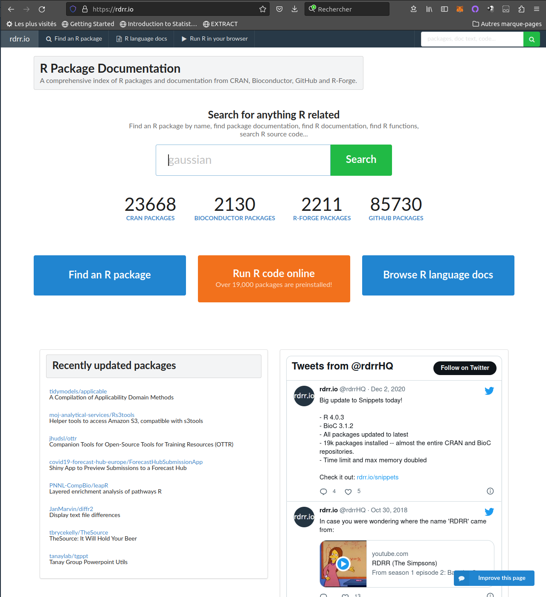
```
]

.pull-right[
- Pour installer une bibliothèque, utilisez la commande `install.packages("nom")`.
- Lui passer des **arguments**.
- L'argument **dependencies = TRUE** pour installer les dépendances.
- Pour supprimer ou mettre à jour une bibliothèque, utilisez les commandes suivantes: 
  - `remove.packages("nom")`.
  - `update.packages("nom")`.

<u> Exemples: </u>
```{r packages_2, eval=FALSE}

#Installer ggplot2
install.packages('ggplot2', 
                 dependencies = TRUE)

#Supprimer ggplot2
remove.packages('ggplot2')
```

]

---

## Les packages (continue)

```{r add_defi-12, echo=FALSE, eval=TRUE, out.width="10%"}
knitr::include_graphics("../images/defi.jpg")
```

- **Installation d'un package**: Installez le package `tidyverse` en utilisant la fonction `install.packages()`. Assurez-vous que le package est bien installé en utilisant la fonction `library()` pour charger le package.

```{r, echo=FALSE}
library(countdown)
countdown(minutes = 00, seconds = 30)
```

---

## Les packages (continue)

**Solution:**

```{r add_defi-12_solution, warning=FALSE}
install.packages('tidyverse', dependencies = TRUE)
library(tidyverse)
```

---

## Importation d'un jeu de données

- Le **format texte** est très commun (`.txt` ou `.csv`).
- Un jeu de données contient:
  - les lignes = **les individus**.
  - les colonnes = **les variables**.
  - un **séparateur de colonnes** = "\t" / "," / ";".
- Supposons que des données soient contenues dans un fichier `donnees.txt`.
- Les données sont importées dans l'objet `data`:

```{r import}
data <- read.table("../data/donnees.txt", sep = ";", header = TRUE, 
                   dec = ",", row.names = 1)
```

*Remarque*:

- Le nom de fichier est entre guillemets.
- L'option `sep` indique que le caractère qui sépare les colonnes est un `;`.
- L'argument `header` indique si la première ligne contient les intitulés des variables.
- L'argument `dec` indique que le sépareur décimal est le caractère `,`.
- L'argument `row.names` indique que la colonne 1 est *l'identifiant des lignes*.

---

## Importation d'un jeu de données (continue)

- Supposons maintenant le nouveau jeu de données `donnees2.txt`.

```{r import2}
data2 <- read.table("../data/donnees2.txt", sep = ";", 
                    header = TRUE, dec = ",", row.names = 1)
data2
```

- Le caractère spécial `NA` indiqe qu'il manque une valeur.
- `na.strings` permet de modifier le caractère de remplacement des valeurs manquantes.

---

## Importation d'un jeu de données (continue)

.pull-left[
```{r env, echo=FALSE, eval=TRUE}
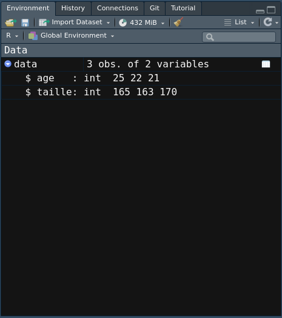
```
]

.pull-right[
- Prenez note que RStudio montre maintenant le jeu de données `data` dans votre espace de travail.

- L'espace de travail inclut tous les objets créés pendant la session R.
]

---

## Visualiser les données

R code  					| action
----------------- | -------------
`data`					  		| Affiche le tableau de données complet dans la console
`head(data)`		  		| Affiche les premières lignes du tableau de données
`tail(data)`         | Affiche les dernières lignes du tableau de données
`names(data)`				| Affiche le nom des colonnes du tableau de données
`attributes(data)`		| Affiche les attributs du tableau de données
`dim(data)`          | Affiche la dimension du tableau de données
`ncol(data)`         | Affiche le nombre de colonnes du tableau de données
`nrow(data)`					| Affiche le nombre de lignes du tableau de données
`summary(data)`			| Calcule quelques statistiques de base sur les variables

---

## Visualiser les données (continue)

La fonction `str()` est très utile pour identifier le type/mode de chaque colonne.

```{r explore}
str(data)
```

---

## Manipuler les variables

<u> Exemples: </u>
Supposons qu'un utilisateur ajoute au jeu de données précédent la colonne sexe.

```{r import3}
data3 <- read.table("../data/donnees3.txt", sep = ";", 
                    header = TRUE, dec = ",", row.names = 1)
str(data3)
```

Le passage de variable type `caractère` en classe se fait via la fonction `factor`.

```{r manip_type}
data3$sexe <- factor(data3$sexe)
str(data3)
```

---

## Manipuler les variables (continue)

Npus souhaitons changer les intitulés des niveaux. On utilise la fonction `levels`.

```{r set_levels}
levels(data3$sexe) <- c("femelle","mâle")
data3$sexe
```

> Attention à l'ordre des facteurs !!

--

- Soit une variable qualitative X codée:
  - 1 = **classique**.
  - 2 = **nouveau**.
  - 3 = **placebo**.
  
```{r levels}
X <- c(1,1,2,2,3,3)
Xfactor <- factor(X, labels = c("classique", "nouveau", "placebo"))
Xfactor
```

---

## Manipuler les variables (continue)

On choisit `placebo` comme valeur de référence; pour cela on utilise la fonction `relevel`:

```{r ref}
Xfactor2 <- relevel(Xfactor, ref = "placebo")
Xfactor2
```

Pour contrôler l'ordre des niveaux, il suffit de recréer un facteur sur le facteur existant.

```{r ordre_levels}
Xfactor3 <- factor(Xfactor, levels = c("placebo", "nouveau", "classique"))
Xfactor3
```
---

## Manipuler les individus

<u> Exemples: </u>

- L'analyste aimerait identifier les lignes où il y a des valeurs manquantes.
- La fonction `is.na` permet de les repérer.

```{r miss_value}
select <- is.na(data2)
```

- Si on veut connaître les couples ligne x colonne des individus portant une valeur manquante, on peut utiliser l'option `arr.ind` de la fonction `which`:

```{r miss_value_2}
which(is.na(data2), arr.ind = TRUE)
```

- Si on veut supprimer les lignes contenant des données manquantes, on peut utiliser la fonction `na.omit`:

```{r miss_value_3}
ndata2 <- na.omit(data2)
```

---

## Manipuler les individus (continue)

- Maintenant on va s'intéresser à identifier **des valeurs aberrantes**.
- On va utiliser pour cela un jeu de données célébre `iris`.

```{r data_iris, out.width="20%"}
data(iris) #150x5
boxplot(iris[,"Sepal.Width"])
```

--

- La composante `out` de la sortie de la fonction `boxplot`.

```{r outliers}
resultat<- boxplot(iris[,"Sepal.Width"], plot = FALSE)
valeurs_aberrantes <- resultat$out
valeurs_aberrantes
```

---

## Manipuler les individus (continue)

- Pour trouver les **indices** de ces valeurs aberrantes, vous pouvez utiliser le code suivant:

```{r outliers_2}
which(iris[,"Sepal.Width"] %in% valeurs_aberrantes)
niris <- iris[which(!(iris[,"Sepal.Width"] 
                      %in% valeurs_aberrantes)),]
dim(niris)
```

---

## Manipuler les individus (continue)

.pull-left[
- Il arrive également que **des doublons** soient présent dans notre jeu de données.

```{r df2}
df <- data.frame(C1 = c("a","b", "b", "a", "a"), 
                 C2 = c(1,2,2,3,1))
```

- La fonction `unique` permet de garder les individus différents.

```{r unique_df}
unique(df)
```
]

.pull-right[
- La fonction `duplicated` permet de repérer les individus identiques en retournant un booléen.

```{r duplicate_df}
duplicated(df)
```

- Pour extraire les doublons, il suffit:

```{r dduplicate_df}
df[duplicated(df),]
```
]

---

## Exportation d'un jeu de données

- L'exportation d'un tableau au format texte suit :

```{r export}
write.table(data, "../data/monresultat.txt", sep = ";")
```

- D'autres options sont possibles:
  - `col.names` = le jeu de données contient-il le nom des colonnes ?
  - `row.names` = le jeu de données contient-il le nom des lignes ?
  - ...

---

## Manipulation des données

```{r add_defi-13, echo=FALSE, eval=TRUE, out.width="10%"}
knitr::include_graphics("../images/defi.jpg")
```

Jeu de données : Le jeu de données `diabetes` contient des informations sur des patients atteints de diabète. Il contient des informations sur 442 patients et 11 variables, y compris l'âge, le sexe, l'indice de masse corporelle (IMC) et six mesures de résultats médicaux.

Lien pour télécharger les données : https://www4.stat.ncsu.edu/~boos/var.select/diabetes.tab.txt

<u> Importation des données </u>

1. Téléchargez le fichier `diabetes.tab.txt` à partir du lien ci-dessus et vous l'importez dans R en tant que data.frame nommé "diabetes".

2. Inspectez le data.frame et notez le nombre de variables et le nombre d'individus.

3. Vérifiez la présence de données manquantes.

```{r, echo=FALSE}
library(countdown)
countdown(minutes = 25, seconds = 00)
```

---

## Manipulation des données (suite)

```{r add_defi-13_2, echo=FALSE, eval=TRUE, out.width="10%"}
knitr::include_graphics("../images/defi.jpg")
```

<u> Exportation des données </u>

1. Exportez le data.frame précédemment importé en tant que fichier csv nommé "diabetes_export.csv".

2. Vérifiez si le fichier exporté est bien dans votre répertoire de travail.

<u> Manipulation des variables </u>

1. Créez un facteur de la variable SEX avec les labels Femmes et Hommes.

2. Combien y a t'il d'Hommes et de Femmes ?

3. Créez une nouvelle variable nommée "diabetes_risk" qui est la somme des variables "bmi", "bp" et "age".

4. Renommez la variable "y" en "diabetes_outcome".

5. Supprimez les variables "s1", "s2", "s3", "s4", "s5" et "s6" du data frame.

---

## Manipulation des données (suite)

```{r add_defi-13_3, echo=FALSE, eval=TRUE, out.width="10%"}
knitr::include_graphics("../images/defi.jpg")
```

<u> Manipulation des individus </u>

1. Sélectionnez les patients qui ont un IMC supérieur à 30 et les patients qui ont une pression artérielle (bp) supérieure à 80.

3. A partir de cette sélection, créez un nouveau data frame avec uniquement les variables "diabetes_outcome", "age", "sex" et "diabetes_risk"

4. Récupérez les autres individus n'appartenant pas à cette sélection dans un autre data frame puis comparez. Qu'observez-vous ?

---

## Manipulation des données (suite)

**Solution:**

<u> Importation des données </u>

```{r manage_data}


#### 1 ####
diabetes <- read.table(file = "../data/diabetes.tab.txt", 
                       header = TRUE, sep = "\t")

#### 2 ####
str(diabetes)
dim(diabetes)
```

---

## Manipulation des données (suite)

**Solution:**

<u> Importation des données </u>

```{r manage_data_2}

#### 3 ####
res <- is.na(diabetes)
unique(res)
summary(diabetes[1:4])
```

---

## Manipulation des données (suite)

**Solution:**

<u> Importation des données </u>

```{r manage_data_3}

#### 3 ####
summary(diabetes[5:11])
```

---

## Manipulation des données (suite)

**Solution:**

<u> Exportation des données </u>

```{r manage_data_4}

#### 1 ####

write.csv(diabetes, file = "../data/diabetes_export.csv", sep = "\t", 
          row.names = FALSE, col.names = TRUE)
```

---

## Manipulation des données (suite)

**Solution:**

<u> Manipulation des variables </u>

```{r manage_data_5}

#### 1 ####
diabetes$SEX <- factor(diabetes$SEX, labels = c("Femme", "Homme"))

#### 2 ####
table(diabetes$SEX)

#### 3 ####
diabetes$diabetes_risk <- diabetes$BMI + diabetes$BP + diabetes$AGE

#### 4 ####
names(diabetes)[names(diabetes) == "Y"] <- "diabetes_outcome"
#colnames(diabetes)[11] <- "diabetes_outcome"


```

---

## Manipulation des données (suite)

**Solution:**

<u> Manipulation des variables </u>

```{r manage_data_6}

#### 5 ####
diabetes$S1 <- NULL; diabetes$S2 <- NULL; diabetes$S3 <- NULL;
diabetes$S4 <- NULL; diabetes$S5 <- NULL; diabetes$S6 <- NULL

#sub_diabetes <- diabetes[,c(1:4,11:12)]

```

---

## Manipulation des données (suite)

**Solution:**

<u> Manipulation des individus </u>

```{r manage_data_7}

#### 1 ####
high_diabetes <- diabetes[(diabetes$BMI >30 & diabetes$BP > 80 ),]

#### 2 ####
high_diabetes <- high_diabetes[, c("AGE", "SEX", "diabetes_outcome", "diabetes_risk")]

#### 3 ####
indices <- row.names(high_diabetes)

#### 3 ####
low_diabetes <- diabetes[!row.names(diabetes) %in% indices,]
low_diabetes <- low_diabetes[, c("AGE", "SEX", "diabetes_outcome", "diabetes_risk")]

```

---

## Manipulation des données (suite)

**Solution:**

<u> Manipulation des individus </u>
.pull-left[
```{r manage_data_8_part1}

#### 4 ####
summary(low_diabetes[1:2]);summary(low_diabetes[3:4]) 
```
]

.pull-right[
```{r manage_data_8_part2}

#### 4 ####
summary(high_diabetes[1:2]);summary(high_diabetes[3:4]) 

```
]

---

## Le monde du tidyverse

- Le tidyverse est un **ensemble de packages**:
  - Manipulation et visualisation des données.
  - Philosophie de programmation commune (`tidy data`).
  - Syntaxe cohérente pour l'analyse de données.

- Les packages les plus connus:
  - `dplyr`.
  - `ggplot2`.
  - `tidyr`.
  - `purrr`.

---
## tidyr

- Le but de ce package est de crée des `données ordonnées`:

  - Chaque colonne est une variable.
  
  - Chaque ligne est une observation.
  
  - Chaque cellule à une seule valeur.
  
```{r tidyr, echo=FALSE, eval=TRUE, out.width="20%", fig.align='center'}
knitr::include_graphics("../Logos/tidyr.png")
```

---

## tidyr: Manipuler vos données

- Le paquet tidyr permet de manipuler la structure d'un data frame en préservant les informations d'origine.

```{r tidyr_reshape, echo=FALSE, eval=TRUE, fig.align='center'}
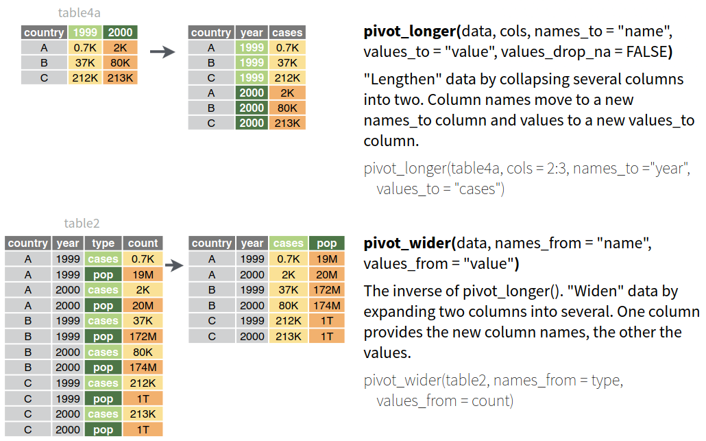
```


---

## tidyr: tibble

- `Tibble` est un format alternatif et plus pratique que celui d'un data frame:

  - Les `tibbles` ont une présentation de sortie plus propre que les data.frames.

  - Les `tibbles` permettent d'appliquer des fonctions sur des colonnes de manière plus intuitive.

---

## tidyr: tibble (continue)

 Les `tibbles` ont une présentation de sortie plus propre que les data frames.
 
.pull-left[
```{r create_df}
 df <- data.frame(
  x = c(1, 2, 3),
  y = c("a", "b", "c")
)
df
```
]
.pull-right[
  
```{r create_tb} 
library(tidyr)
tb <- tibble(
  x = c(1, 2, 3),
  y = c("a", "b", "c")
)
tb
```
]

---

## tidyr: séparer et regrouper des colonnes

```{r tidyr_split, echo=FALSE, eval=TRUE, fig.align='center'}
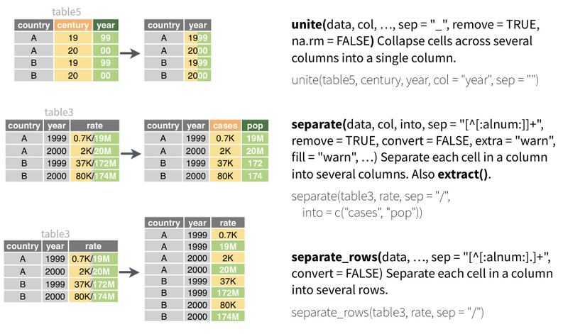
```

---

## tidyr: créer de nouvelles combinaisons et gérer les valeurs manquantes

.pull-left[
```{r tidyr_expand, echo=FALSE, eval=TRUE, fig.align='center'}
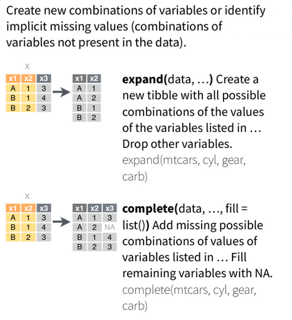
```
]

.pull-right[
```{r tidyr_na, echo=FALSE, eval=TRUE, fig.align='center'}
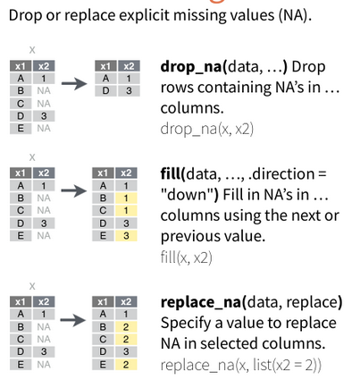
```
]
---

## tidyr

```{r add_defi-14, echo=FALSE, eval=TRUE, out.width="10%"}
knitr::include_graphics("../images/defi.jpg")
```

**Réorganiser les données**

Réorganiser les données de la table ci-jointe pour qu'il y ait une colonne pour chaque variable et une ligne pour chaque observation.

```{r ex-1, eval=FALSE}

library(tidyr)

# Exemple de tibble
tb <- tibble(
  id = 1:3,
  age = c(25, 30, 28),
  height = c(170, 175, 180),
  weight = c(70, 75, 80)
)
```

```{r, echo=FALSE}
library(countdown)
countdown(minutes = 5, seconds = 00)
```

---

## tidyr

**Solution: Réorganiser les données**

.pull-left[
```{r ex-1_solution}
library(tidyr)

# Exemple de tibble
tb <- tibble(
  id = 1:3,
  age = c(25, 30, 28),
  height = c(170, 175, 180),
  weight = c(70, 75, 80)
)

tb_long <- pivot_longer(tb, 
             cols = c(age, weight, height),
             names_to = "variable",
             values_to = "valeur")

```
]
.pull-right[
```{r ex-1_print}
tb_long
```
]

---

## tidyr (continue)

```{r add_defi-14_2, echo=FALSE, eval=TRUE, out.width="10%"}
knitr::include_graphics("../images/defi.jpg")
```

**Séparer les données en colonnes**

Le tibble ci-joint contient des informations qui doivent être séparées en plusieurs colonnes distinctes.

```{r ex-2, eval=FALSE}
# Exemple de tibble
tb <- tibble(
  id = 1:3,
  name = c("John Smith", "Jane Doe", "Bob Johnson"),
  age = c(25, 30, 28)
)
```

```{r, echo=FALSE}
library(countdown)
countdown(minutes = 4, seconds = 00)
```

---

## tidyr (continue)

**Solution: Séparer les données en colonnes**

.pull-left[
```{r ex-2_solution}
library(tidyr)

# Exemple de tibble
tb <- tibble(
  id = 1:3,
  name = c("John Smith", "Jane Doe", "Bob Johnson"),
  age = c(25, 30, 28)
)

# Utilisation de la fonction separate() pour séparer la colonne nom_prenom en deux colonnes nom et prenom
tb_sep <- separate(tb, name, into = c("first_name", "last_name"), sep = " ")
```
]
.pull-right[
```{r ex-2_print}
tb_sep
```
]


---

## tidyr (continue)

```{r add_defi-14_3, echo=FALSE, eval=TRUE, out.width="10%"}
knitr::include_graphics("../images/defi.jpg")
```

**Combiner les données de plusieurs colonnes**

Le tibble ci-joint contient plusieurs colonnes qui doivent être combinées en une seule colonne.

```{r ex-3, eval=FALSE}
# Exemple de tibble
tb <- tibble(
  id = 1:3,
  first_name = c("John", "Jane", "Bob"),
  last_name = c("Smith","Doe", "Johnson"),
  age = c(25, 30, 28)
)
```

```{r, echo=FALSE}
library(countdown)
countdown(minutes = 4, seconds = 00)
```

---

## tidyr (continue)


**Solution: Combiner les données de plusieurs colonnes**

.pull-left[
```{r ex-3_solution}
library(tidyr)

tb <- tibble(
  id = 1:3,
  first_name = c("John", "Jane", "Bob"),
  last_name = c("Smith","Doe", "Johnson"),
  age = c(25, 30, 28)
)

# Utilisation de la fonction unite() pour fusionner les colonnes jour et mois en une colonne date
tb_unite <- unite(tb, full_name, c(first_name, last_name), sep = " ")

```
]
.pull-right[
```{r ex-3_print}
tb_unite
```
]


---

## tidyr (continue)

```{r add_defi-14_4, echo=FALSE, eval=TRUE, out.width="10%"}
knitr::include_graphics("../images/defi.jpg")
```

**Réorganiser les données**

Supposons que vous ayez un ensemble de données contenant des informations sur les ventes de produits dans différentes régions au cours de différentes périodes.   
Transformez ces données de manière à avoir une colonne par période, avec les ventes correspondantes pour chaque produit et région.

```{r ex-4, eval=FALSE}
region <- c("North", "North", "South", "South")
period <- c("Q1", "Q2", "Q1", "Q2")
product <- c("A", "A", "B", "B")
sales <- c(100, 150, 200, 250)

tb <- tibble(region, period, product, sales)

```

```{r, echo=FALSE}
library(countdown)
countdown(minutes = 5, seconds = 00)
```

---

## tidyr (continue)

**Solution: Réorganiser les données**

.pull-left[
```{r ex-4_solution}
library(tidyr)

# Exemple de tibble
region <- c("North", "North", "South", "South")
period <- c("Q1", "Q2", "Q1", "Q2")
product <- c("A", "A", "B", "B")
sales <- c(100, 150, 200, 250)

tb <- tibble(region, period, product, sales)

# Utilisation de la fonction pivot_wider() pour transformer le tibble en format "large"
tb_wide <- pivot_wider(tb, names_from = period, values_from = sales)

```
]
.pull-right[
```{r ex-4_print}
tb_wide
```
]


---

## dplyr

- Ce package fournit un ensemble de fonctions (ou verbes) pour la manipulation de données:

  - `mutate()`: crée une nouvelle colonne de données (ou transforme une colonne existante).
  
  - `select()`: sélectionne des colonnes dans un jeu de données.
  
  - `filter()`: filtre des rangées suivant les critères spécifiés.
  
  - `summarise()`: créer un sommaire de variables au sein de groupes distincts dans un jeu de données en utilisant des fonctions d'aggrégation.
  
  - `arrange()`: trie les données d'une colonne en ordre croissant ou décroissant.
  
```{r dplyr, echo=FALSE, eval=TRUE, out.width="15%", fig.align='center'}
knitr::include_graphics("../Logos/dplyr.png")
```

---

## dplyr (suite)

### select() - selection de colonnes

```{r dplyr_select, echo=FALSE, eval=TRUE, fig.align='center'}
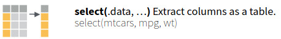
```

---

## dplyr (suite)

### select() - selection de colonnes (suite)

```{r dplyr_selecthelper, echo=FALSE, eval=TRUE, fig.align='center', out.width="70%"}
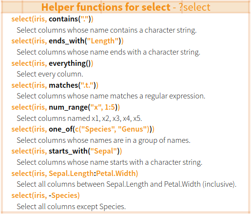
```

---

## dplyr (suite)

### filter() - selection de lignes

```{r dplyr_filter, echo=FALSE, eval=TRUE, fig.align='center'}
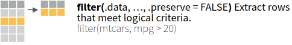
```

```{r dplyr_logic, echo=FALSE, eval=TRUE, fig.align='center'}
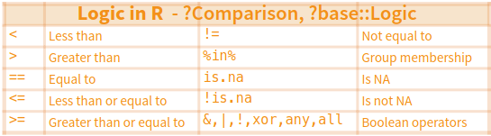
```

---

## dplyr (suite)

### arrange() - ordonner des lignes

```{r dplyr_arrange, echo=FALSE, eval=TRUE, fig.align='center'}
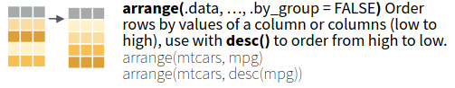
```

---

## dplyr (suite)

### mutate() - créer/modifier des colonnes

```{r dplyr_mutate, echo=FALSE, eval=TRUE, fig.align='center'}
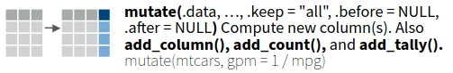
```

---

## dplyr (suite)

### summarise() - créer des stats récapitulatives

.pull-left[
```{r dplyr_summarise, echo=FALSE, eval=TRUE, fig.align='center'}
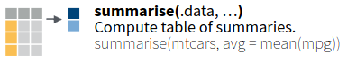
```
]

.pull-right[
```{r dplyr_summarise_2, echo=FALSE, eval=TRUE, fig.align='center', out.width="70%"}
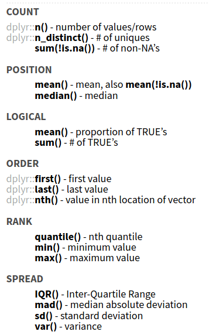
```
]


---

## dplyr (suite)

Soit la table suivante:

```{r tbl}
library(tidyverse)

set.seed(1234)
tbl <- tibble(group1 = rep(c("A", "B"), each = 5000),
              group2 = rep(c("C", "D"), each = 5000),
              value = rnorm(10000),
              weight = sample(1:10, 10000, replace = TRUE))
tbl
```

---

## dplyr (suite)

Si on sélectionne les colonnes *group1* et *weight* puis on filtre le résultat pour ne garder que les lignes dont le *poids est > à 9*.

.pull-left[
**solution 1**:

```{r tbl_2}
library(tidyverse)

tmp <- select(tbl, group1, 
              weight)
print(filter(tmp, 
             weight > 9), n=4)

```
]

.pull-right[
**solution 2**

```{r tbl_3}
library(tidyverse)

print(filter(select(tbl, 
                    group1, 
                    weight), 
             weight > 9), 
      n = 4)
```
]

---

## dplyr (suite)

Le **tidyverse** propose une alternative avec le `%>%`.

```{r tbl_4}
library(tidyverse)

tbl %>% 
  select(group1, weight) %>% 
  filter(weight > 9) %>% 
  print(, n= 4)
```

---

## dplyr (suite)

### group_by() - regrouper le jeu de données par un facteur

```{r dplyr_group, echo=FALSE, eval=TRUE, fig.align='center'}
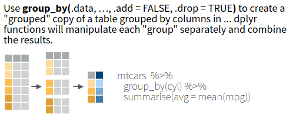
```

---

## dplyr (suite)

```{r add_defi-15, echo=FALSE, eval=TRUE, out.width="10%"}
knitr::include_graphics("../images/defi.jpg")
```

1. Chargez les données sur les vols d'avions à partir du package `nycflights13` et stockez-les dans un data frame appelé `vols`.
2. Affichez les premières observations de `vols`.
3. Sélectionnez les colonnes *year*, *month* et *day* de `vols`.
4. Sélectionnez seulement les vols qui se sont produits en novembre.
5. Trouvez le nombre total de vols par année.
6. Triez les observations de `vols` par année croissante, puis par mois croissant, puis par jour croissant.
7. Créez une nouvelle variable appelée *weekday* qui contient le jour de la semaine pour chaque observation.
8. Transformez la variable *carrier* en colonnes et calculer le nombre total de vol par compagnie aérienne.

```{r, echo = FALSE}
countdown(minutes = 25, seconds = 00)
```

---

## dplyr (suite)

**Solution:**

```{r dplyr_solutions}
library(dplyr)
library(nycflights13)
#### 1 ####
vols <- nycflights13::flights 
#### 2 ####
head(vols)
```

---

**Solution:**

.pull-left[
```{r dplyr_solutions_part2}
#### 3 ####
vols_select <- select(vols, year, month, day)
head(vols_select)
```
]

.pull-right[
```{r dplyr_solutions_part3}
#### 4 ####
vols_filter <- filter(vols, month == 11)
head(vols_filter)
```
]

---

**Solution:**

```{r dplyr_solutions_part4}
#### 5 ####
vols_group <- group_by(vols, year)
vols_summarize <- summarize(vols_group, total_vols = n())
vols_summarize

#### 6 ####
vols_arrange <- arrange(vols, year, month, day)
head(vols_arrange)
```

---

**Solution:**

```{r dplyr_solutions_part5}
#### 7 ####
vols_mutate <- mutate(vols, weekday = weekdays(as.Date(paste(vols$year, 
                                              vols$month, 
                                              vols$day, sep = "-"))))

#### 8 ####
vols_wide <- tidyr::pivot_wider(vols, 
                            names_from = carrier, 
                            values_from = flight,
                            values_fill = 0)
head(vols_wide)
```

---

**Solution:**

```{r dplyr_solutions_part6}
#### 8 ####
glimpse(select(vols_wide, 18:33) %>% colSums())
```

