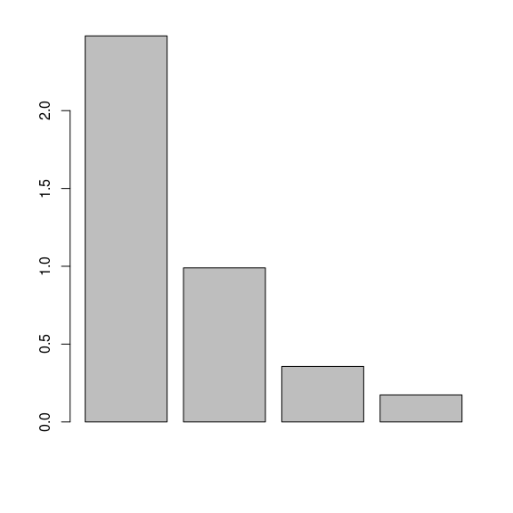

```{r setup, include=FALSE}
options(htmltools.dir.version = FALSE)
knitr::opts_chunk$set(
  comment = "#",
  collapse = TRUE,
  #cache = TRUE,
  warning = FALSE,
  message = FALSE,
  fig.width=6, fig.height=6,
  fig.retina = 3,
  fig.align = 'center'
)
```

```{r logo, echo=FALSE}
xaringanExtra::use_logo(image_url = "logo_cnrs.png")
```

# Objectifs d'apprentissage

1. Apprendre les bases de l'analyse multivariée pour révéler des patrons dans les données.

2. Utiliser `R` pour effectuer une ordination sans contrainte.

3. Utiliser `R` pour créer des dendrogrammes.

4. Utiliser `R` pour effectuer une ordination sous contrainte.

---

# La classification ascendante hierarchique (CAH)

- **Regrouper** des individus en fonction de leur *similarité*.

- Permet **d'évaluer** des degrés de *proximité* ou *d'appartenance* à ces groupes.

- Vise à **subdiviser** une population en *groupes (classes) d'individus* les plus semblables possibles.

- La réalisation d'une **CAH** se déroule en deux étapes:

  - Calcul de la matrice de distance entre individus.
  
  - Regroupement en classes.
  
- Les résultats sont représentés sous la forme d'un **dendrogramme**.

---

# La classification ascendante hierarchique (CAH)

## Le choix de la distance

- **La distance euclidienne:**

  - Variables quantitatives;
  
  - Il peut-être nécessaire de centrer réduire les variables.
  
  - Le principe ....

- **La distance de Bray-Curtis:**

  - Echelle comprise entre 0 et 1;
  
  - Abandance ou de comptage;
  
  - Le principe est de faire la somme des différence de la mesure pour chacune des variables entre deux individus statistiques rapportée à la mesure totale.
  
---

## Le choix de la distance (suite)
  
- **La distance de Jaccard:**

  - Echelle comprise entre 0 et 1;
  
  - Variables binaires.
  
  - Le principe est de comparer les individus par paires en supprimant les variables pour lesquelles il y a co-absence puis de faire le rapport entre le nombre d'observations faites uniquement pour l'un des individus et le nombre d'observations totales.

---

## Le choix de la méthode pour regrouper

- **Le lien moyen (UPGMA):**

  - Calculer la distance moyenne entre toutes les paires de classe;
  
  - Sensible aux valeurs extrêmes.

- **La méthode de Ward:**

  - Calculer la distance au carré entre les éléments des classes et le barycentre de leur classe.

  - Maximiser l'inertie inter classe à chaque étape et donc à minimiser l'inertie intra classe.

---

## Fonction R

> vegdist{vegan}

- Arguments: *method=* `"euclidean"`, `"bray"`, `"jaccard"`

> hclust{stats}

- Arguments: *method=* `"average"`, `"ward.D2"`

Le fichier de données est un tableau avec les individus en ligne et les variables en colonnes.

---

## Cas d'étude

> Des scientifiques se rendent sur différents sites pour faire des comptages d'oiseaux.
Ils disposent d'un tableau de présence / absence avec sur chaque ligne, les différentes stations de mesure et sur chaque colonne les espèces identifiées.

---

### Importation et observation des données

```{r, echo=TRUE}
oisPA <- read.csv("../data/Ois_PA.csv", sep = ";")
str(oisPA)
oisPA2 <- oisPA[, -1]
```

---

### Calcul de la matrice de distance

```{r, echo=TRUE}
library(vegan)
DisJac <- vegdist(oisPA2, 
                  method = "jaccard")
```

---

### Classification ascendante hiérarchique


.pull-left[
```{r, echo=TRUE}
clustSite <- hclust(DisJac, 
                    method = "ward.D2")
plot(clustSite,
     hang = -1,
     labels = oisPA[, 1])
```
]

--

.pull-right[
```{r, echo=TRUE}
clustSite <- hclust(DisJac, 
                    method = "ward.D2")
plot(clustSite,
     hang = -1,
     labels = oisPA[, 1])
rect.hclust(clustSite, k=4, 
            border = "black")
```
]

---

#### Nombre de groupe

```{r, echo=TRUE}
inertie <- sort(clustSite$height, decreasing = TRUE)
plot(inertie, type = "s", xaxt = "n")
```

---

### Calcul de la matrice de distance (espèces)

```{r, echo=TRUE}
library(vegan)
DisJac2 <- vegdist(t(oisPA2), 
                   method = "jaccard")
```

---

### Classification ascendante hiérarchique (espèces)

```{r, echo=TRUE, fig.height = 5}
ClustOis <- hclust(DisJac2, 
                   method = "ward.D2")
plot(ClustOis, 
     hang = -1, 
     xlab = "", 
     sub = "")
rect.hclust(ClustOis, k=4, 
            border = "black")
```

---

# CAH

```{r add_defi, echo=FALSE, eval=TRUE, out.width="10%", fig.align='left'}
knitr::include_graphics("../images/defi.jpg")
```

- Vous allez utiliser le dataset "USArrests" qui contient les taux d'arrestation pour divers crimes aux États-Unis en 1973.

- Vous allez réaliser la CAH pour regrouper les états en clusters et ainsi répondre à :

  - Combien de clusters avez-vous identifiés ?
  
  - Comment interprétez-vous les résultats obtenus ?

---

# CAH

**Solution:**

```{r, echo=TRUE}

# Charger le dataset "USArrests"
data(USArrests)
head(USArrests)

```

---

# CAH (suite)

```{r, echo=TRUE}
library(vegan)

# Standardiser les variables
USArrests_standard <- scale(USArrests)

# Calculer la matrice des distances
distances <- vegdist(USArrests_standard, method = "euclidean")

# Réaliser la CAH
cluster <- hclust(distances, method = "ward.D2")
```

---

# CAH (suite)

```{r, echo=TRUE}
inertie <- sort(cluster$height, decreasing = TRUE)
plot(inertie, type = "s", xaxt = "n")
```

---

# CAH (suite)

```{r, echo=TRUE, fig.width=10}
plot(cluster,
     hang = -1,
     labels = row.names(USArrests))
rect.hclust(cluster, k=4, 
            border = "black")
```


---

# Méthodes d'ordination sans contrainte

- Nous allons examiner 5 méthodes **d'ordination sans contraintes**:

  - L'**A**nalyse en **C**omposantes **P**rincipales (ACP)
  
  - L'**A**nalyse **F**actorielle des **C**orrespondances (AFC)
  
  - L'**A**nalyse des **C**orrespondances **M**ultiples (ACM)
  
  - L'Analyse Hill-Smith
  
  - Le Positionnement multidimensionnel non métrique (NMDS)

---

# L'Analyse en composantes principales (ACP)

- Technique de réduction de dimensionnalité.

- Transforme les variables originales en **composantes principales**.

- Les objectifs de l'ACP sont:

  - Faire le bilan des corrélations entre variables;
  
  - Evaluer les ressemblances et différences entre individus;
  
  - Etudier les relations entre les individus et les variables.

---

## Conditions d'utilisation

- Données quantitatives continues.

- Nombre d'individus élevés.

- Les variables doivent-être centrées et réduites (optionnel).

- Normalité des données.

- Adapté aux gradients qui présentent une variation monotone.

- Sensible au double zéro.

---

## En pratique

- Les étapes de l'ACP sont les suivantes:

  1. pré-traitement des données;
  
  2. choix du nombre d'axes à conserver;
  
  3. analyse de l'organisation des variables;
  
  4. analyse des individus.

---

## Fonction R

> dudi.pca{ade4}

## Cas d'étude

> Reprenons le dataset "USArrests" pour résoudre une ACP et analyser les individus et l'organisation des variables.

### Importation des données

```{r, echo=TRUE}
library(ade4)
data(USArrests)
```

---

### Vérification et pré-traitement des données

- L'ACP se base sur la mesure de coefficients de corrélation de Pearson.

- Les variables doivent-être misent à l'échelle.

.pull-left[
```{r, echo=TRUE}
USArrests_standard <- scale(USArrests)

#Visualisation des corrélations
table.value(cor(USArrests_standard))
```
]

.pull-right[
```{r, echo=TRUE}
#Visualisation de la linéarité
pairs(USArrests_standard)
```
]

---

### Choix du nombre d'axes à conserver

- Se base sur les composantes principales.

- Déterminer l'inertie.

- Plusieurs méthodes existent:

  - Critère du **coude de Catwell**.
  
  - **70% de l'inertie**.
  
  - Critère de **Kaiser**.

```{r, echo=TRUE, eval=FALSE}
pcaUSArrests <- dudi.pca(USArrests)
inertia.dudi(pcaUSArrests)
```

---

### Choix du nombre d'axes à conserver (suite)

```{r, echo=FALSE}
readRDS(file = "../../inertia_pca.rds")

```

---

### Interprétation de l'espace factoriel

L'analyse des variables se déroule de la façon suivante :

1. L'analyse des $cos^2$ et/ou du cercle des corrélations, 

2. ce qui permet d'interpréter les axes,

3. On étudie les corrélations entre variables.

```{r, echo=FALSE, include=FALSE}
pcaUSArrests <- readRDS(file = "../../pcaUSArrests.rds")
```

.pull-left[
```{r, echo=TRUE, fig.height=4}
s.corcircle(pcaUSArrests$co)
```
]

.pull-right[
<u>Interprétation:</u> On voit que les trois variables *Murder*, *Assault* et *Rape* sont corrélées entre elles et explique la variabilité de la CP1.   
En revanche, c'est *UrbanPop* qui explique majoritairement la variabilité de la CP2.
]

---

### Interprétation de l'espace factoriel (suite)

- Nous pouvons afficher également la valeur des $\cos²$.

- Plus la valeur du $\cos²$ d'une variable sur un axe est élevée, plus la variable contribue à l'axe.


```{r, echo=TRUE}
cos2 <- inertia.dudi(pcaUSArrests, col.inertia = TRUE)
cos2$col.rel
```

<u>Interprétation:</u> Les valeurs de $\cos²$ confirme l'interprétation décrite plus haut, soit une forte contribution des variables *Murder*, *Assault* et *Rape* pour l'axe 1 et *UrbanPop* pour l'axe 2. 

---

### Analyse des individus

- On analyse la contribution des individus aux axes en analysant le $\cos²$.

- On cherche à identifier les ressemblances entre les individus.

- On interprète les liaisons entre individus et variables.

- On peut caractériser certains individus en particulier.

---

### Analyse des individus (suite)

.pull-left[
```{r, echo=TRUE, message=FALSE}
scatter(pcaUSArrests, 
        posieig="none", 
        xax = 1, 
        yax = 2)
```
]

.pull-right[
```{r, echo=TRUE}
s.value(pcaUSArrests$li, 
        scale(USArrests$Murder))
```
]

---

### variables supplémentaires

- Ajout d'une variable sans modifier l'analyse précédemment construite.

- variables **supplémentaires** ou **passives**.

- Aider à interpréter les axes.

- Caractériser de nouvelles variables.

- variable doit-être quantitative (autant d'individus).

#### Fonction R

> supcol{ade4}
> supcol(ResultatACP, data.frame(scalewt(VariablesSuplementaires)))$cosup

---

#### Cas d'étude

```{r, echo=TRUE, fig.height=5}
#ACP sur les variables actives
pcaUSArrests <- readRDS(file = "../../pcaUSArrests.rds")

#Création d'une variable supplémentaire
score <- as.numeric(apply(USArrests, MARGIN = 1, sum))

#Graphique
s.arrow(pcaUSArrests$co, xlim = c(-2, 1.5), ylim = c(-1.5, 1.5), clabel = 0.8)
symbols(0, 0, circles = 1, inches = FALSE, add = TRUE)
s.arrow(supcol(pcaUSArrests, data.frame(scalewt(score)))$co, label = "SCORE", add.p = TRUE, clabel = 1.1)
```

---

### individus supplémentaires

- Les individus supplémentaires ont obtenu des valeurs sur chaque variable

#### Fonction R

> suprow{ade4}

---

#### Cas d'étude

```{r, echo=TRUE, echo = TRUE, eval=FALSE}
# ACP sur les individus actifs
pcaUSArrests <- readRDS(file = "../../pcaUSArrests.rds")

# Chargement des individus supplémentaires
IndSup <- data.frame(Murder = 7, Assault = 159, UrbanPop = 66, Rape = 20)
row.names(IndSup) <- "FR"
LocaSup <- suprow(pcaUSArrests, IndSup)

#Combine les individus
pcaUSArrests$li <- rbind(pcaUSArrests$li, LocaSup$lisup)

#Graphique
scatter(pcaUSArrests, xax = 1, yax = 2)
```

---

#### Cas d'étude

```{r, echo=TRUE, echo = FALSE, eval=TRUE}
# ACP sur les individus actifs
pcaUSArrests <- readRDS(file = "../../pcaUSArrests.rds")

# Chargement des individus supplémentaires
IndSup <- data.frame(Murder = 7, Assault = 159, UrbanPop = 66, Rape = 20)
row.names(IndSup) <- "FR"
LocaSup <- suprow(pcaUSArrests, IndSup)

#Combine les individus
pcaUSArrests$li <- rbind(pcaUSArrests$li, LocaSup$lisup)

#Graphique
scatter(pcaUSArrests, posieig = "none", xax = 1, yax = 2)
```


---

# L'Analyse en composantes principales (ACP)

```{r add_defi2, echo=FALSE, eval=TRUE, out.width="10%", fig.align='left'}
knitr::include_graphics("../images/defi.jpg")
```

<u>Jeu de données:</u> : "Iris" dataset disponible dans R. C'est un jeu de données bien connu en science des données qui contient des mesures de quatre variables (longueur et largeur des sépales et des pétales) pour trois espèces d'iris (setosa, versicolor et virginica).

1. Chargez le jeu de données `Iris`.

2. Sélectionnez les quatre variables numériques dans le jeu de données : longueur et largeur des sépales et des pétales.
  
3. Standardisez les données.
  
4. Effectuez l'ACP.
  
5. Analyse des résultats.

---

# L'Analyse en composantes principales (ACP)

**Solution:**

```{r, echo=TRUE}
##### 1 ######
data("iris")
head(iris)
```

---

# L'ACP (suite)

**Solution:**

```{r, echo=TRUE}
####2#######
iris_vars <- iris[,1:4]
head(iris_vars)
```

```{r, echo=TRUE}
####3#####
iris_scaled <- scale(iris_vars)
```

---

# L'ACP (suite)

**Solution:**


```{r, echo=TRUE}
####4
iris_acp <- dudi.pca(iris_scaled, scannf = FALSE, nf = 2)
```

.pull-left[
```{r, echo=TRUE, fig.height=4}
#####5
s.corcircle(iris_acp$co)
```
]

.pull-right[
```{r, echo=TRUE}
cos2 <- inertia.dudi(iris_acp, col.inertia = TRUE)
cos2$col.rel
```
]

---

# L'ACP (suite)

**Solution:**

.pull-left[
```{r, echo=TRUE, fig.height=4}
#######5
scatter(iris_acp, 
        posieig="none", 
        xax = 1, 
        yax = 2)
```
]

.pull-right[
```{r, echo=TRUE, }
s.label(iris_acp$li, label = rownames(iris), clabel = 0.75)
s.class(iris_acp$li, iris$Species, add.plot = TRUE)
```
]

---

# L'Analyse factorielle des correspondancs (AFC)

- Etudier les relations entre les différentes modalités de **deux variables qualitatives**.

- Permet d'analyser un tableau de contingence.

- Utilise la métrique du $\chi^2$.

## En pratique

1. Test du $\chi²$ d'indépendance.

2. On étudie les composantes pour évaluer le nombre d'axes à conserver.

3. On analyse les résultats.

---

## Fonction R

>dudi.coa{ade4}

## Cas d'étude

> Nous allons reprendre le cas d'étude sur le comptage des oiseaux effecué par des scientifiques. A chaque fois qu'ils observent des oiseaux ils notent le lileu dans ils se trouvent ainsi que les espèces observées. 

---

### Importation et inspection des données

```{r, echo=TRUE}
library(ade4)
Ois <- read.csv("../../presentation/data/Oiseaux.csv",
                sep = ";", header = TRUE)
str(Ois)
head(Ois)
```

---

#### Création de la table de contingence

```{r, echo=TRUE}
tableOis <- table(Ois$site, Ois$espece)
tableOis
```

---

#### Création de la table de contingence (autre visualisation)

```{r, echo=TRUE}
table.value(tableOis, col.labels = colnames(tableOis),
            csize = 0.75, clegend = 0.75)
```

---

### Réalisation de l'AFC

```{r, echo=TRUE, eval=FALSE}
afc1 <- dudi.coa(as.data.frame.matrix(tableOis))
```

#### Affichage de l'inertie

```{r, echo=TRUE}
afc1 <- readRDS("../../afc1.rds")

#Afficher l'inertie
inertia.dudi(afc1)
```

---

#### Graphique et contribution relative

.pull-left[
```{r, echo=TRUE}
scatter(afc1, posieig = "bottomleft", clab.row = 1, clab.col = 0.75)
```
]

.pull-right[
```{r, echo=TRUE}
inertia.dudi(afc1, row.inertia = TRUE)[4]
```
]

---

#### Interprétation

Le plan factoriel montre la séparation des milieux étudiés en 4 groupes. 
- L'axe 1 sépare le milieu *Ville* des milieux *Zone humide* et *Forêt*.
- Le milieu *Champ* se trouve en position centrale.
- L'axe 2 sépare *Foret* de *Zone_humide*.

Certaine espèces apprécient un milieu plutôt qu'un autre tandis que certaines en apprécient plusieurs.

---

# L'Analyse factorielle des correspondances (AFC)

```{r add_defi3, echo=FALSE, eval=TRUE, out.width="10%", fig.align='left'}
knitr::include_graphics("../images/defi.jpg")
```

<u>Jeu de données:</u> `HairEyeColor` contient des données sur la couleur des cheveux, des yeux et le sexe de 592 personnes.

1. Chargez le jeu de données.

2. Sélectionnez les variables `Hair`, `Eye` pour les Hommes.

3. Effectuez l'AFC.

4. Visualisez les résultats de l'AFC.

---

# L'Analyse factorielle des correspondances (AFC)

**Solution:**

```{r, echo = TRUE}
####1
data(HairEyeColor)
head(HairEyeColor)
```

---

# L'AFC (suite)

**Solution:**

```{r, echo = TRUE}
####2
hair_eye_male <- HairEyeColor[,,1]
hair_eye_male
```

---

# L'AFC (suite)

**Solution:**

```{r, echo = TRUE}
####3
afc_male <- dudi.coa(as.data.frame.matrix(hair_eye_male), scannf = FALSE, nf = 2)
inertia.dudi(afc_male)
```

---

# L'AFC (suite)

**Solution:**

```{r, echo=TRUE}
######4
scatter(afc_male, posieig = "bottomleft", clab.row = 1, clab.col = 0.75)
```

---

# L'Analyse des correspondances multiples (ACM)

- Etudier les relations entre les différentes modalités de **plus de deux variables qualitatives**.

- Utilise une métrique proche du $\chi^2$.

---

## En pratique

Généralisation de l'AFC.

---

## Fonction R

>dudi.acm{ade4}

---

## Cas d'étude

> Des scientifiques ont reporté différentes variables environnementales relatives à son habitat telles que le dénivelé, la surface boisée... Ils ont également invéntorié les signalements de l'ours dans la région des Alpes Françaises depuis un siècle.

---

### Importation et inspection des données

```{r, echo=TRUE}
library(ade4)
data("ours")
str(ours)
```

---

### Réalisation de l'ACM

```{r, echo=TRUE, eval=FALSE}
acm1 <- dudi.acm(ours[,1:8])
```

#### Affichage de l'inertie

```{r, echo=TRUE}
acm1 <- readRDS("../../acm1.rds")
inertia.dudi(acm1)
```

---

#### Affichage de l'inertie (suite)

```{r, echo=TRUE}
acm1 <- readRDS("../../acm1.rds")
inertia.dudi(acm1)
```

---

#### Graphique et rapports de corrélation

.pull-left[
```{r, echo=TRUE}
scatter(acm1)
```
]

.pull-right[
```{r, echo=TRUE}
acm1$cr
```
]

---

#### Interprétation

Nous pouvons voir que les régions qui ont la proportion la plus importante d'altitude comprise entre 800m et 2000m (3, *altit*) sont également celles qui présentent la surface boisée la plus importante (3, *boise*), celles où la surface de forêt mélangée est la plus importante (3, *hetra*), et ce sont celles qui possèdent la plus grande proportion d'habitat favorable à l'ours (3, *favor*).

---

### Variables supplémentaires

- Comme l'ACP, on peut introduire des variables supplémentaires.

---

#### Cas d'étude

> On souhaite projeter la colonne **citat** sur le plan factoriel en tant que variable supplémentaire.

```{r, echo=TRUE}
s.label(acm1$li, clabel = 0, pch = 20)
s.class(acm1$li, ours[,9], add.plot = TRUE)
```

---

# L'Analyse des correspondances multiples (ACM)

```{r add_defi4, echo=FALSE, eval=TRUE, out.width="10%", fig.align='left'}
knitr::include_graphics("../images/defi.jpg")
```

<u>Jeu de données:</u>Poison Ce jeu de données fait référence à une enquête réalisée auprès d’un échantillon d’enfants de l’école primaire qui ont souffert d’intoxication alimentaire. Ils ont été interrogés sur leurs symptômes et sur ce qu’ils ont mangé. 

1. Chargez le jeu de données.

2. Effectuez l'ACM.

3. Visualisez les résultats de l'ACM.

```{r, echo=FALSE}
library(countdown)
countdown(minutes = 5, seconds = 00)
```

---

# L'Analyse des correspondances multiples (ACM)

**Solution:**


```{r, echo=TRUE}
### 1 ###
library(FactoMineR)
data("poison")
```

```{r, echo=TRUE}
### 2 ###
library(ade4)
res.acm <- dudi.acm(poison[,5:15], scannf = FALSE, nf = 2)
inertia.dudi(res.acm)
```

---

# ACM (suite)

**Solution:**

.pull-left[
```{r, echo=TRUE}
scatter(res.acm)
```
]

.pull-right[
```{r, echo=TRUE}
res.acm$cr
```
]

---

# CAH sur résultats d'analyse factorielle

## Réalisons une AFC

```{r, echo=TRUE}
oisPA <- read.csv("../data/Ois_PA.csv", sep = ";")
oisPA2 <- oisPA[, -1]

library(ade4)
afc2 <- dudi.coa(oisPA2, scannf = FALSE, nf = 2)
```

## Calcul de la marice de distance

```{r, echo=TRUE}
library(vegan)
DistAfc <- vegdist(afc2$li, method = "euclidean")
```

---

## Réalisation de la CAH

```{r, echo=TRUE}
ClustAfc <- hclust(DistAfc, method = "ward.D2")
```

---

## Visualisation de l'inertie et du dendrogramme

.pull-left[
```{r, echo=TRUE}
plot(ClustAfc, hang = -1, labels = oisPA[,1], xlab = "", sub = "")
rect.hclust(ClustAfc, k = 3, border = "black")
```
]

.pull-right[
```{r, echo=TRUE}
inertie2 <- sort(ClustAfc$height, decreasing = TRUE)
plot(inertie2, type = "s", xaxt = "n", ylab = "Inertie", xlab = "Nombre de groupes")
```
]

---

## Visualisation du plan factoriel

```{r, echo=TRUE}
CutClustAfc <- cutree(ClustAfc, k=3)
data.frame(Site = oisPA[,1], Groupe = CutClustAfc)
```

---

## Visualisation du plan factoriel (suite)

.pull-left[
```{r, echo=TRUE}
s.label(afc2$li, clabel = 0.75, boxes = FALSE, label = oisPA[,1])
s.label(afc2$co, clabel = 0.75, add.plot = TRUE)
s.class(afc2$li, as.factor(CutClustAfc), axesell = FALSE, add.plot = TRUE)
```
]

.pull-right[
Le plan factoriel montre comment les espèces sont inféodés à certains milieux.
]

---

# L'analyse Hill-Smith

- Etudier les relations entre variables et éventuellement de positionner les individus.

- Traiter des variables de types différents: variables quantitatives, qualitatives.

---

## En pratique

Les étapes sont les mêmes que celles d'une ACP.

## Fonction R

> dudi.mix{ade}

---

## Cas d'étude

> Une enquête founit les variables suivantes : âge, sexe, taille, pointure, lieu d'habitation à la naissance, poids réel, poids rêvé, couleur des yeux, couleur des cheveux.

### Importation et inspection des données

```{r, echo=TRUE}
library(ade4)
donnees <- read.csv("../../presentation/data/enquete.csv", stringsAsFactors = TRUE)
str(donnees)
```

---

### Réalisation de l'analyse et visualisation de l'inertie

```{r, echo=TRUE}
HSEnq <- dudi.mix(df = donnees, scannf = FALSE, nf = 4)
inertia.dudi(HSEnq)
```

---

### Représentation de l'espace des variables

.pull-left[
```{r, echo=TRUE}
s.corcircle(HSEnq$co)
```
]

.pull-right[
<u>Interprétation:</u>
- Sur l'axe 1, les variables qui contribuent le plus sont la pointure, le le lieu d'habitation en ville et la couleur des yeux verts.
- Sur l'axe 2, les variables qui contribuent le plus sont les couleurs des cheveux bruns et noirs.
]

---

### Représentation de l'espace des variables (suite)

.pull-left[
```{r, echo=TRUE}
s.corcircle(HSEnq$co[,3:4])
```
]

.pull-right[
<u>Interprétation:</u>
- Sur l'axe 3, les variables qui contribuent le plus sont les cheveux et les yeux noirs.
- Sur l'axe 4, les variables qui contribuent le plus sont les couleurs des cheveux bruns, couleurs des yeux marrons, couleur des yeux bleu et couleur des cheveux roux.
]

---

### Représentation des individus

```{r, echo=TRUE}
scatter(HSEnq, row.plab.cex = 1, col.plab.cex = 1.5)
```


---

# L'analyse Hill-Smith

```{r add_defi5, echo=FALSE, eval=TRUE, out.width="10%", fig.align='left'}
knitr::include_graphics("../images/defi.jpg")
```

<u>Jeu de données:</u> Le jeu de données `mtcars` contient des informations sur les caractéristiques de 32 voitures, telles que la cylindrée, la puissance, le poids, etc.

1. Chargez le jeu de données "mtcars".

2. Réalisez une analyse multivariée.

3. Analysez les résultats.

---

# L'analyse Hill-Smith

**Solution:**

```{r, echo=TRUE}
data(mtcars)
```

```{r, echo=TRUE}
res <- dudi.mix(df = mtcars, scannf = FALSE, nf = 2)
inertia.dudi(res)
```

---

# L'analyse Hill-Smith

**Solution:**

.pull-left[
```{r, echo=TRUE}
s.corcircle(res$co)
```
]

.pull-right[
<u>Interprétation:</u>
nous pouvons voir que les variables les plus importantes pour la formation de l'axe principal CS1 sont "mpg", "cyl" et "disp", tandis que les variables les plus importantes pour la formation de l'axe principal CS2 sont "qsec", "am" et "gear".
Ces résultats suggèrent que ces variables sont les plus pertinentes pour discriminer les différentes voitures dans le jeu de données "mtcars" en fonction de leurs caractéristiques.
]

---

# L'analyse Hill-Smith

**Solution:**

```{r, echo =TRUE}
scatter(res, row.plab.cex = 1, col.plab.cex = 1.5)
```

---

# Le Positionnement multidimensionnel non métrique (NMDS)

- Alternative à l'ACP quand les variables ne suivent pas une distribution normale.

- Repose sur un algorithme itératif d'optimisation.

## Fonction R

> metaNMDS{vegan}
>metaNMDS(Comm=donnees, k=nombre) # K indique le nombre de dim.

---

## Cas d'étude

> Le marquage de neurones situés dans deux régions du système nerveux central a permis de mesurer leurs caractéristiques anatomiques (le nombre de synapses afférentes, la longeur de l'axone, la longeur de l'arbre dendritique et le diamètre de leur soma). Ce marquage spécifique a également permis de déterminer leur appartenance à un type cellulaire.   
Mettre en évidence une relation entre les métriques observées d'une part et le type cellulaire ou la région anatomique d'autre part.

### Import et préparation des données

```{r, echo=TRUE}
library(vegan)

df1 <- read.table("../../presentation/data/nrn.txt", header = TRUE)
cT <- as.character(df1[,5])
aR <- as.character(df1[,6])
df2 <- df1[,1:4]
colnames(df2) <- c("nS", "aL", "dL", "sD")
```

---

### Réalisation du NMDS

```{r, echo=TRUE, results='hide'}
nmds1 <- metaMDS(comm = df2, k = 2)
```

```{r, echo=TRUE, results='hide'}
print(paste("stress: ", nmds1$stress))
NMDS1 <- nmds1$points[,1]; NMDS2 <- nmds1$points[,2]
par(mfrow=c(2,2))
stressplot(nmds1, p.col = "black", l.col = "grey", cex=1)
ord1 <- ordiplot(nmds1, type = "none")
points(ord1, "sites", pch=21, col="lightgrey", bg="lightgrey")
text(ord1, "species", col="black", cex=1.25)
plot(NMDS1, NMDS2, col = cT, pch = cT, cex=1)
plot(NMDS1, NMDS2, col = aR, pch = aR, cex=1)
```

---

### Réalisation du NMDS (suite)

.pull-left[
```{r, echo=FALSE}
print(paste("stress: ", nmds1$stress))
NMDS1 <- nmds1$points[,1]; NMDS2 <- nmds1$points[,2]
par(mfrow=c(2,2))
stressplot(nmds1, p.col = "black", l.col = "grey", cex=1)
ord1 <- ordiplot(nmds1, type = "none")
points(ord1, "sites", pch=21, col="lightgrey", bg="lightgrey")
text(ord1, "species", col="black", cex=1.25)
plot(NMDS1, NMDS2, col = cT, pch = cT, cex=1)
plot(NMDS1, NMDS2, col = aR, pch = aR, cex=1)
```
]

.pull-right[
<u>Interprétation:</u>
- L'ajustement du modèle est bon avec un $R²$ très haut.
- La longeur de l'axone et le diamètre du soma sont très proches et que ce sont surtout le nombre de synapses et la longeur de l'arbre dendritique qui permettent de distinguer les éléments.
- Le type cellulaire est bien classé et bien délimité. En revanche, la région anatomique n'est pas influencé par ces différentes métriques.
]

---

# Le Positionnement multidimensionnel non métrique (NMDS)

```{r add_defi6, echo=FALSE, eval=TRUE, out.width="10%", fig.align='left'}
knitr::include_graphics("../images/defi.jpg")
```

<u>Jeu de données:</u> Les données utilisées dans ce tutoriel proviennent du Réseau National des Observatoires Ecologiques (NEON). Les données sont des dénombrements d'espèces de macroinvertébrés benthiques pour les rivières et les lacs de l'ensemble des États-Unis et ont été recueillies entre juillet 2014 et aujourd'hui.

1. Chargez le jeu de données.

2. Effectuez l'analyse NMDS sur le dénombrements d'espèces (var. 4 à 11).

3. Interprétez et Visualisez les résultats.

---

# Le Positionnement multidimensionnel non métrique (NMDS)

**Solution:**

1.

```{r, echo=TRUE}
orders <- read.csv("../../presentation/data/condensed_order.csv", header = TRUE)
head(orders)
aST <- as.factor(orders$aquaticSiteType)
```

---

# NMDS (suite)

**Solution:**

2.

```{r, echo=TRUE}
library(vegan)
nmds_results <- metaMDS(comm = orders[,4:11], k = 2)
```

---

# NMDS (suite)

**Solution:**

3.

```{r, echo = TRUE, fig.height=3}
print(paste("stress: ", nmds_results$stress))
NMDS1 <- nmds_results$points[,1]; NMDS2 <- nmds_results$points[,2]
par(mfrow=c(1,3))
stressplot(nmds_results, p.col = "black", l.col = "grey", cex=1)
ord1 <- ordiplot(nmds_results, type = "none")
points(ord1, "sites", pch=21, col="lightgrey", bg="lightgrey")
text(ord1, "species", col="black", cex=1)
plot(NMDS1, NMDS2, col = aST, cex=1)
```

---

# NMDS (suite)

**Solution:**

3.

En regardant le NMDS, nous voyons que les points noirs (lacs) sont davantage associés aux amphipodes et aux hémiptères. En revanche, les points rouges (ruisseaux) sont davantage associés aux Coléoptères, Éphéméroptères, Trombidiformes et Trichoptères.

Tubificida et Diptera sont situés là où des points noirs (lacs) et rouges (ruisseaux) se trouvent dans le même espace, ce qui implique que ces ordres sont probablement associés à la fois aux ruisseaux et aux lacs.


---

# Méthodes d'ordination sous contrainte

- Nous allons examiner 2 méthodes **d'ordination sous contraintes**:

  - L'**A**nalyse **L**inéaire discriminante (ALD ou LDA)

  - L'**A**nalyse **C**anonique de redondances (ACR ou RDA)
  
---

# Analyse discriminante linéaire

- Expliquer et de prédire les valeurs d'une variable qualitative `Y` à partir de variables explicatives quantitatives/qualitatives.

- Divise la variable réponse en groupes en trouvant une combinaison de variables qui donne la **meilleure séparation possible**.

---

## Cas d'étude

> Dans le cadre d'une étude de la population angevine, le CHU d'Angers s'est interressé à la propension à ronfler d'homme et de femmes. Le fichier `ronfle.txt` contient un échantillon de 100 patients, le variables considérées sont :
- age (années);
- poids (kg);
- taille (cm);
- alcool (nombre de verres bus par jour);
- sexe (F/H);
- ronfle (O/N);
- taba (O/N).

>Le but de cette étude est d'expliquer le ronflement par les autres variables.

---

### Importer les données

```{r, echo=TRUE}
donnees <- read.table("../../presentation/data/ronfle.txt", header = TRUE)
summary(donnees)
```

---

### Fonction R

> lda{mass}
> lda(Y ~ X1+X2)

### Construire le modèle

```{r, echo=TRUE}
library(MASS)
mod.complet <- lda(ronfle ~ ., data = donnees)
mod.complet$scaling
```

---

### Estimer le taux de mauvais classement

```{r, echo=TRUE}
prev.complet <- lda(ronfle~., data = donnees, CV=TRUE)$class

# tableau des classifications a priori et prédites
spe.table <- table(prev.complet, donnees$ronfle)

# proportion de mauvaise classification
1 - diag(prop.table(spe.table, 1))
```

---

### Faire de la prévision

```{r, echo=TRUE}

# charger les nouvelles données
new_df <- data.frame(age = c(42, 58, 35, 67),
                     poids = c(55, 94, 70, 63),
                     taille = c(169, 185, 180, 166),
                     alcool = c(0,4, 6, 3),
                     sexe = c("F", "H", "H", "F"),
                     taba = c("N", "O", "O", "N"))

# prédiction sur les nouvelles données
predict.group <- predict(mod.complet, newdata = new_df)
```

---

# Analyse discriminante linéaire

```{r add_defi7, echo=FALSE, eval=TRUE, out.width="10%", fig.align='left'}
knitr::include_graphics("../images/defi.jpg")
```

<u>Jeu de données:</u> : "Iris" dataset disponible dans R. C'est un jeu de données bien connu en science des données qui contient des mesures de quatre variables (longueur et largeur des sépales et des pétales) pour trois espèces d'iris (setosa, versicolor et virginica).

1. Chargez le jeu de données `iris`.

2. Divisez le jeu de données en un ensemble d'apprentissage et un ensemble de test.

3. Effectuez l'analyse LDA en utilisant les variables explicatives "Sepal.Length" et "Sepal.Width" pour prédire la variable réponse "Species".

4. Utilisez le modèle LDA pour prédire les classes de l'ensemble de test.

5. Évaluez la précision du modèle en comparant les prédictions avec les classes réelles de l'ensemble de test

---

# Analyse discriminante linéaire

**Solution:**

1.

```{r, echo=TRUE}
data(iris)
```

---

# Analyse discriminante linéaire (suite)

**Solution:**

2.

```{r, echo=TRUE}
set.seed(123)
index <- sample(1:nrow(iris), round(nrow(iris)*0.7))
train_data <- iris[index,]
test_data <- iris[-index,]
```

---

# Analyse discriminante linéaire (suite)

**Solution:**


3.

```{r, echo=TRUE}
library(MASS)
lda_model <- lda(Species ~ Sepal.Length + Sepal.Width, data = train_data)
lda_model
```

---

# Analyse discriminante linéaire (suite)

**Solution:**

4.

```{r, echo=TRUE}
predictions <- predict(lda_model, newdata = test_data)
conf_matrix <- table(predictions$class, test_data$Species)
conf_matrix
```

5.

```{r, echo=TRUE}
accuracy <- sum(diag(conf_matrix))/sum(conf_matrix)
accuracy
```

---

# Analyse canonique de redondances

- Extension directe de la régression multiple.

- Modélise l'effet d'une matrice X sur une matrice Y.

- Variables peuvent être quantitatives, qualitatives ou binaires.

---

## Cas d'étude
 
> Le jeu de données "fishes" contient des informations sur l'abondance de différentes espèces de poissons en fonction de l'habitat. 

### Fonction R

> rda{vegan}   
> rda(X, Y)

---

### Importer et préparer les données

```{r, echo=TRUE}

# Charger le jeu de données
fishes <- read.csv("../../presentation/data/fishes.csv")

Resp <- fishes[,c(2:7)]
Expl <- fishes[,c(8:11)]
```

---

### Réaliser une RDA

```{r, echo=TRUE}
library(vegan)
res.rda <- vegan::rda(Expl, Resp)
head(summary(res.rda, display = NULL))
```

---

### Réaliser une RDA

- Variance de Y expliquée par X représente 99% .

- Variance de Y non expliquée par X représente 0.01%.

---

### Ajustement du modèle

```{r, echo=TRUE}
RsquareAdj(res.rda)
```

### Significativité d'une RDA

```{r, echo=TRUE}
anova.cca(res.rda, permutations = 1000)
```

---

### Représentation graphique

.pull-left[
```{r, echo=TRUE}
ordiplot(res.rda,
         scaling = 1,
         type = "text")
```
]

.pull-right[
```{r, echo=TRUE}
ordiplot(res.rda,
         scaling = 2,
         type = "text")
```
]


---

# Analyse canonique de redondances

```{r add_defi8, echo=FALSE, eval=TRUE, out.width="10%", fig.align='left'}
knitr::include_graphics("../images/defi.jpg")
```

<u>Jeu de données:</u> Le dataset "Wisconsin Breast Cancer" contient des mesures de caractéristiques de cellules tumorales pour des tumeurs du sein. Les données contiennent des informations sur la taille et la forme des cellules, la densité de la tumeur et d'autres caractéristiques. L'objectif de cet exercice est d'identifier quelles caractéristiques des cellules tumorales sont les plus fortement associées à un diagnostic de tumeur maligne ou bénigne.

1. Chargez le fichier `breast-cancer-wisconsin.csv`.

2. Supprimer les colonnes non nécessaires.

3. Convertir la variable de réponse (Class) en facteur.

4. Sélectionner les variables à inclure dans l'analyse. Dans cet exemple, nous allons inclure toutes les variables de caractéristiques des cellules tumorales.

5. Effectuer une Analyse Canonique de Redondances (ACR) pour identifier quelles caractéristiques des cellules tumorales sont les plus fortement associées à un diagnostic de tumeur maligne ou bénigne.

6. Interpréter les résultats de l'ACR et discuter quelles caractéristiques des cellules tumorales sont les plus fortement associées à un diagnostic de tumeur maligne ou bénigne.

---

# Analyse canonique de redondances

**Solution:**

1.

```{r, echo = TRUE}
data <- read.csv("../../presentation/data/breast-cancer-wisconsin.csv", header = TRUE)
```

2.

```{r, echo = TRUE}
data <- data[, -1]
```

---

# Analyse canonique de redondances (suite)

**Solution:**

3.

```{r, echo=TRUE}
data$Class <- factor(data$Class, levels = c(2,4), labels = c("benign", "malignant"))
data$Bare_Nuclei <- as.integer(data$Bare_Nuclei)
data2 <- na.omit(data)
```

4.

```{r, echo=TRUE}
vars <- c("Clump_Thickness", "Uniformity_of_Cell_Size", "Uniformity_of_Cell_Shape", "Marginal_Adhesion", "Single_Epithelial_Cell_Size", "Bare_Nuclei", "Bland_Chromatin", "Normal_Nucleoli", "Mitoses")
```

---

# Analyse canonique de redondances (suite)

**Solution:**

5.

```{r, echo=TRUE}
library(vegan)
rda_result <- rda(data2[,vars], data2$Class)
head(summary(rda_result, display = NULL))
summary(rda_result)[[1]]
```

---

```{r, echo=TRUE}
RsquareAdj(rda_result)
```

```{r, echo=TRUE}
anova.cca(res.rda, permutations = 1000)
```

---

.pull-left[
```{r, echo=TRUE}
ordiplot(rda_result,
         scaling = 1,
         type = "text")
```
]

.pull-right[
```{r, echo=TRUE}
ordiplot(rda_result,
         scaling = 2,
         type = "text")
```
